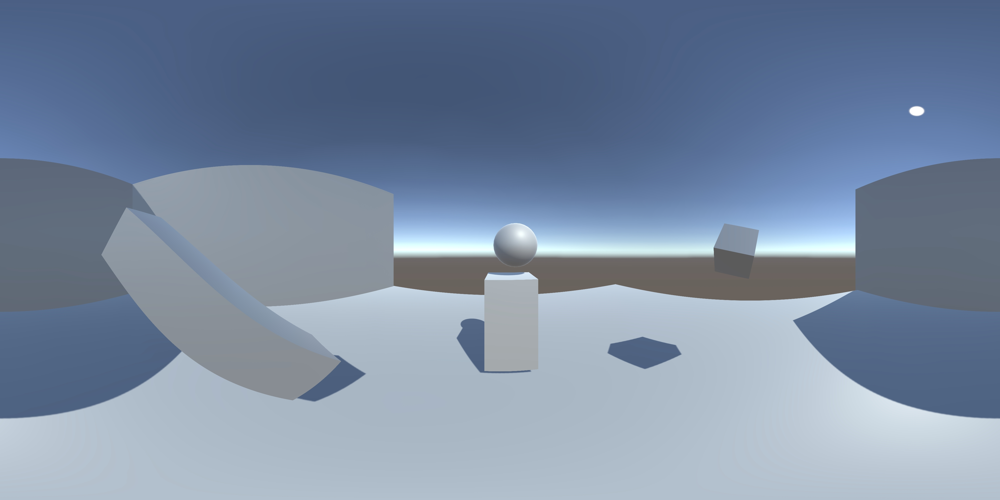

# Unity 360° Screenshot Capture
This simple script captures a **360° photo** with your Unity camera and injects the necessary **XMP metadata** to it; so the output image supports 360° viewers on the web out-of-the-box (like *Facebook* and *Flickr*). Note that the output image is in JPEG format.

The raw image is in equirectangular form. Here is an example screenshot, [which looks like this](https://flic.kr/p/VPxPwY) when uploaded to *Flickr*:


## How to Use
Simply call `I360Render.Capture()`, which will return a 1024x512 **byte[]** object that you can write to a file using `File.WriteAllBytes`. You can also call it like `I360Render.Capture( imageWidth, renderCamera )`. Be aware that maximum allowed image width is 8192 pixels.

Example code:
```csharp
using System.IO;
using UnityEngine;

public class RenderTest : MonoBehaviour 
{
	// Must be a power of 2, max. size is 8192
	public int imageWidth = 1024;

	void Update()
	{
		if( Input.GetKeyDown( KeyCode.P ) )
		{
			byte[] jpegBytes = I360Render.Capture( imageWidth );
			if( jpegBytes != null )
			{
				string path = Path.Combine( Application.persistentDataPath, "360render.jpeg" );
				File.WriteAllBytes( path, jpegBytes );
				Debug.Log( "360 render saved to " + path );
			}
		}
	}
}
```
